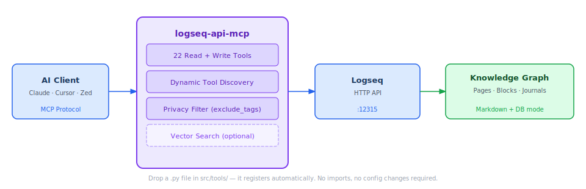

# logseq-api-mcp

**Your AI assistant starts every session blind to your Logseq knowledge graph. logseq-api-mcp fixes that: 21 tools to read, write, query, and search your notes — auto-registered the moment you drop a Python file into `src/tools/`.**

[](https://www.python.org/)
[](LICENSE)
[](https://github.com/gustavo-meilus/logseq-api-mcp/actions/workflows/ci.yml)
[]()
[]()
[](https://github.com/gustavo-meilus/logseq-api-mcp/stargazers)

<picture>
  <source media="(prefers-color-scheme: dark)" srcset="assets/architecture-dark.svg">
  <source media="(prefers-color-scheme: light)" srcset="assets/architecture-light.svg">
  
</picture>

---

## Quick Start

**Step 1 — Install**

```bash
git clone https://github.com/gustavo-meilus/logseq-api-mcp.git
cd logseq-api-mcp
uv sync
```

**Step 2 — Configure**

```bash
cp .env.template .env
# open .env and set LOGSEQ_API_ENDPOINT and LOGSEQ_API_TOKEN
```

Getting your token: open Logseq, go to **Settings → Features → Developer mode**, enable **HTTP APIs server**, and copy the token shown. The default endpoint is `http://127.0.0.1:12315/api`.

**Step 3 — Connect**

```jsonc
// ~/.claude/claude_desktop_config.json
{
  "mcpServers": {
    "logseq-api": {
      "command": "uv",
      "args": ["run", "--directory", "/path/to/logseq-api-mcp", "python", "src/server.py"],
      "env": {
        "LOGSEQ_API_ENDPOINT": "http://127.0.0.1:12315/api",
        "LOGSEQ_API_TOKEN": "your_token_here"
      }
    }
  }
}
```

Restart Claude Desktop. All 21 tools are live.

---

## Tools

### Read (12 tools)

| Tool | What it does |
|---|---|
| `get_all_pages` | Every page with ID, UUID, journal flag, and namespace |
| `get_page_blocks` | Hierarchical block tree with IDs, UUIDs, and child counts |
| `get_page_links` | Pages linking to a target page |
| `get_page_backlinks` | Full backlink analysis including block-level references |
| `get_block_content` | Block detail with properties and immediate children |
| `get_all_page_content` | Complete page: properties, blocks, DB refs expanded |
| `get_linked_flashcards` | Q&A flashcard pairs from a page and all linked pages |
| `search` | Full-text search across blocks, pages, and file names |
| `query` | Raw Datalog / DSL queries against the graph |
| `find_pages_by_property` | Filter pages by property key and optional value |
| `get_pages_from_namespace` | All pages under a Logseq namespace |
| `get_pages_tree_from_namespace` | Nested tree of namespace pages |

### Write (10 tools)

| Tool | What it does |
|---|---|
| `create_page` | Create a page with optional properties and format |
| `delete_page` | Remove a page permanently |
| `rename_page` | Rename a page and update all references |
| `update_page` | Append or replace content on an existing page |
| `append_block_in_page` | Add blocks at the end of a page |
| `edit_block` | Replace a block's content by UUID |
| `update_block` | Update block content by UUID |
| `insert_nested_block` | Insert a child or sibling block relative to another block |
| `delete_block` | Delete a block by UUID |
| `set_block_properties` | Set structured properties on a block (DB-mode only) |

---

## Configuration

| Variable | Default | Description |
|---|---|---|
| `LOGSEQ_API_ENDPOINT` | `http://127.0.0.1:12315/api` | Logseq HTTP API base URL |
| `LOGSEQ_API_TOKEN` | *(required)* | Bearer auth token |
| `LOGSEQ_VERIFY_SSL` | `true` | Set `false` to skip TLS verification |
| `LOGSEQ_DB_MODE` | `false` | Enable Logseq database-format API paths |
| `LOGSEQ_EXCLUDE_TAGS` | *(empty)* | Comma-separated tags — pages with any tag are hidden |
| `LOGSEQ_LOG_LEVEL` | `WARNING` | Log level: `DEBUG`, `INFO`, `WARNING`, `ERROR` |

---

## DB-Mode

Logseq's newer database format stores graph data in SQLite rather than markdown files. Set `LOGSEQ_DB_MODE=true` to unlock `set_block_properties`, UUID-reference resolution in `get_all_page_content`, and Datalog-powered queries in `find_pages_by_property`. Tools that do not apply in DB-mode return a clear error rather than silently failing.

---

## Privacy

Any page tagged with a tag from `LOGSEQ_EXCLUDE_TAGS` disappears from every read operation. Enforcement runs at query time, so toggling the variable takes effect immediately.

| Operation | Behavior when page is excluded |
|---|---|
| `get_all_pages` | Excluded pages absent from the listing |
| `search` | Excluded pages and their blocks stripped from results |
| `query` | Results post-filtered against excluded page names |
| `find_pages_by_property` | Results post-filtered |
| `get_page_backlinks` | Excluded source pages removed |
| `get_all_page_content` | Returns `❌ Access denied` for the excluded page |

---

## Adding a Tool

Create `src/tools/my_tool.py`. No imports, no registration, no config changes needed. The discovery system picks it up on the next server start.

```python
from typing import List
from mcp.types import TextContent
from src.client.logseq_client import LogseqClient
from src.client.config import LogseqConfig, load_config
from src.logging_setup import get_logger

_log = get_logger(__name__)

async def _run(
    client: LogseqClient, config: LogseqConfig, param: str
) -> List[TextContent]:
    try:
        _log.debug("%s called", __name__)
        result = await client.some_api_method(param)
        return [TextContent(type="text", text=str(result))]
    except Exception as exc:
        _log.error("exception in %s: %s", __name__, exc, exc_info=True)
        return [TextContent(type="text", text=f"❌ Error: {exc}")]

async def my_tool(param: str) -> List[TextContent]:
    """One-line description — this becomes the MCP tool description."""
    cfg = load_config()
    return await _run(LogseqClient(cfg), cfg, param)
```

The `_run(client, config, ...)` pattern keeps the logic testable via `FakeLogseqClient` in `tests/conftest.py`. Function names starting with `_` are not registered.

---

## Development

```bash
uv sync --dev                                                        # all deps
uv run --group test pytest tests/ -v                                 # test suite (345 tests)
uv run --group test pytest tests/ --cov=src --cov-fail-under=85      # coverage gate
uv run ruff check --fix && uv run ruff format                        # lint + format
uv run mypy src/ --ignore-missing-imports                            # type check
uv run bandit -r src/                                                # security scan
uv run mcp dev src/server.py                                         # MCP inspector
```

---

## Star History

[](https://star-history.com/#gustavo-meilus/logseq-api-mcp&Date)

---

## License

MIT — see [LICENSE](LICENSE).

---

*Made for the Logseq and MCP communities.*
